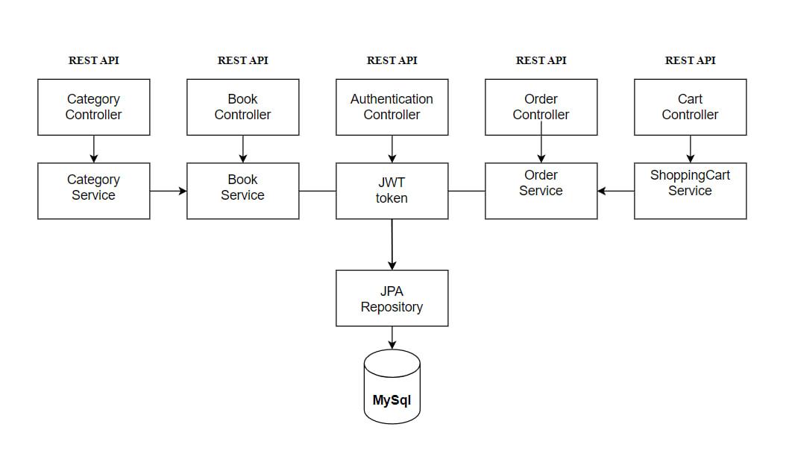
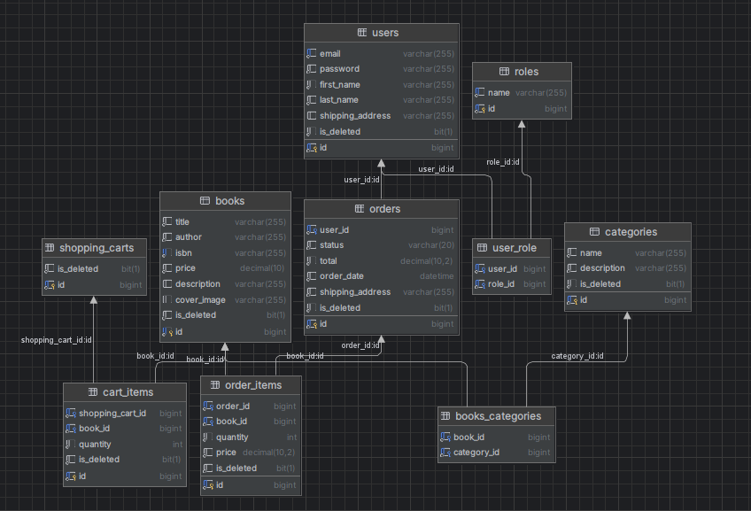

# <h1 align="center">📚 Online Book Store App 📚</h1>

___

  <a href="#introduction">Introduction</a> ♦
  <a href="#technologies">Technologies</a> ♦
  <a href="#project-architecture">Project architecture</a> ♦
  <a href="#database-structure">Database structure</a> ♦
  <a href="#models">Main Models</a> ♦
  <a href="#how-to-run">How run this project</a> ♦
  <a href="#controllers">Controllers</a> ♦
  <a href="#contacts">Contacts</a>

___
<h2 id="introduction"> Introduction</h2>

*Welcome to Book Store App!* 👋

Our Book Store App is a convenient and secure app, which will definitely be the best solution
for you as a passionate reader and yours book choice. We use authorization via JWT to protect access to the app.
All users are divided into admins and users which provides them with certain rights in the app.
You can also find appropriate book with its category, add to shopping cart in case to retrieve it and then
purchase it as an order item.
📖✨ Happy reading! If you have any questions or need assistance, 
our team is here to make your book-buying experience exceptional.

<h2 id="technologies"> 🔨 Technologies </h2>
<ul>
 <li> Java 17</li>
 <li> Maven</li>
 <li> Spring boot, Spring JPA, Spring Security</li>
 <li> Lombok</li>
 <li> MapStruct</li>
 <li> MySql 8</li>
 <li> Hibernate</li>
 <li> Liquibase</li>

[//]: # ( <li> JUnit5 <i><small>&#40;+ Mockito&#41;</small></i></li>)
[//]: # ( <li> <a href="https://www.docker.com/">Docker</a></li>)
[//]: # ( <li> Swagger</li>)
</ul>

<h2 id="project-architecture"> Project architecture </h2>

<h2 id="database-structure"> 🛢️ Database structure </h2>

<h2 id="models"> Main models</h2>

### Book:
The Book model is a fundamental component of our representing individual books available in our inventory, 
encompassing key attributes for effective
management and user interaction.  
It includes the following attributes:

* Title: The title of a book
* Author: The author or authors of the book.
* ISBN:  A unique identifier for the book.
* Price: A decimal value in $USD, indicating the price of the book
* Description: A brief summary or description of the book.
* Cover Image: An image representing the book cover

### User (Customer):
This model is a basic representation of customer information
and is commonly used in user management systems for applications.
The password field is securely hashed and stored.  
It includes the following attributes:

* Email: String, representing the user's email address.
* First name: String, representing the user's first name.
* Last name: String, representing the user's last name.
* Password: String, representing the user's password.
* Shipping Address: String, represents the user's preferred shipping address for product deliveries.
* Roles:defines the user's roles within the application. 
Roles determine the permissions and access levels granted to the user. 
Each role is represented as a Enum.
* Shopping cart: Card which represents the items added by the user for purchase.

### Category:
This model represents a category within our application, 
providing a structured way to organize 
and classify items or products.  
It includes the following attributes:

* Name: String, representing the name of the category. 
* Description: String, providing a brief description or additional information about the category.

### ShoppingCart
This model is designed to manage the items added by users for purchase, 
providing a streamlined way to organize and track items within a shopping cart.  
It includes the following attributes:

* User: A reference to the associated user, indicating ownership of the shopping cart.
* CartItems: A set of CartItem entities representing items added to the shopping cart.

### CartItem
This model serves as a pivotal component within our application's shopping cart functionality. 
It acts as a bridge between individual books and a user's shopping cart, 
allowing for the efficient representation of items added to the cart.
It includes the following attributes:

* Shopping Cart: Reference to the associated shopping cart, indicating the cart to which the item belongs.
* Book: Reference to the associated book, representing the specific product added to the shopping cart.
* Quantity: Integer value indicating the quantity of the associated book added to the shopping cart.

### Order
The "Order" class model represents a customer's order within our application, 
capturing key information related to the order's status, total amount, order date, 
shipping address, and associated order items.

* User: Reference to the user, who placed the order.
* Status: Enumerated type, representing the status of the order (e.g., DELIVERED, PENDING, COMPLETED, CANCELED, NEW).
* Total: Decimal value indicating the total amount of the order.
* Order Date: Date and time, when the order was placed.
* Shipping Address: String, representing the shipping address for delivering the order.
* Order Items: represent individual items included in the order. The set is associated with the order using the "order" field in the OrderItem class.

### OrderItem
The "OrderItem" class model plays a crucial role in representing individual items within a customer's order. 
It establishes a connection between a specific book and an order, 
capturing key details such as quantity and price.

* Order: Reference to the associated order, indicating the order to which the item belongs.
* Book: Reference to the associated book, representing the specific product included in the order.
* Quantity: Integer value indicating the quantity of the associated book included in the order.
* Price: Decimal value indicating the price of a single unit of the associated book within the order.

<h2 id="controllers"> Controllers and endpoints available ⬇</h2>

Unauthorized customers can access endpoints to see all books or additional info about the book.
After registration and login customer can check available books, see info about their quantity,
category, description, price and pay for book. 
Admin can modify data: add a new book, update info about them, update book's status, etc.

### **Authentication Controller:**

| **HTTP method** |      **Endpoint**      | **Role** | **Function**                               |
|:---------------:|:----------------------:|:--------:|:-------------------------------------------|
|      POST       | /api/auth/registration |   ALL    | Allows a new user to register              |
|      POST       |    /api/auth/login     |   ALL    | Authenticates a user and returns JWT token |

---
### **Book Controller:** _Updating and getting user info_

| **HTTP method** |      **Endpoint**      | **Role** | **Function**                               |
|:---------------:|:----------------------:|:--------:|:-------------------------------------------|
|       GET       |       /api/book        |   USER   | Enable users to see the list of books      |
|       GET       |     /api/book/{id}     |   USER   | Enable users to get available books by id  |
|      POST       |       /api/books       |  ADMIN   | Enables admin to create a new book         |
|       PUT       |    /api/books/{id}     |  ADMIN   | Enables admin to update book               |
|     DELETE      | /api/books/delete/{id} |  ADMIN   | Enables admin to delete certain book by id |

----
### **Category Controller:** _Managing and browsing cars_

| **HTTP method** |            **Endpoint**             | **Role** | **Function**                                      |
|:---------------:|:-----------------------------------:|:--------:|:--------------------------------------------------|
|       GET       |           /api/categories           |   USER   | Enables users to get all categories               |
|       GET       |        /api/categories/{id}         |   USER   | Enables users to get info on a category           |
|      POST       |           /api/categories           |  ADMIN   | Enables admin to add a new category to book       |
|       PUT       |        /api/categories/{id}         |  ADMIN   | Enables admin to update category on existing book |
|     DELETE      |        /api/categories/{id}         |  ADMIN   | Enables admin to delete a category by id          |

---
### **Order Controller:** _Managing orders_

| **HTTP method** |             **Endpoint**             | **Role** | **Function**                                              |
|:---------------:|:------------------------------------:|:--------:|:----------------------------------------------------------|
|       GET       |             /api/orders              |   USER   | Enables users to get all their orders                     |
|       GET       |     /api/orders/{orderId}/items      |   USER   | Enables users to get all their items by appropriate order |
|       GET       | /api/orders/{orderId}/items/{itemId} |   USER   | Enables users to get a specific item within an order      |
|      POST       |             /api/orders              |   USER   | Enables users to place an order                           |
|      PATCH      |           /api/orders/{id}           |  ADMIN   | Enables admin to update order with its status             |

---
### **ShoppingCart Controller:** _Managing and browsing rentals_

| **HTTP method** |                      **Endpoint**                       | **Role** | **Function**                                            |
|:---------------:|:-------------------------------------------------------:|:--------:|:--------------------------------------------------------|
|       GET       |                        /api/cart                        |   USER   | Enables users store all the items in shopping cart      |
|      POST       |                        /api/cart                        |   USER   | Enables users to add book to the shopping cart          |
|       GET       |            /api/cart/cart-items/{cartItemId}            |  ADMIN   | Enables admin to update the quantity of available books |
|     DELETE      |            /api/cart/cart-items/{cartItemId}            |   USER   | Enables users to delete book from cart                  |

<h2 id="contacts"> 📞 Contacts</h2>

Email:volodymyr.sych.jv@gmail.com

Telegram:https://t.me/vodolym11

LinkedIn:https://www.linkedin.com/in/volodymyr-sych-b2958a290/

